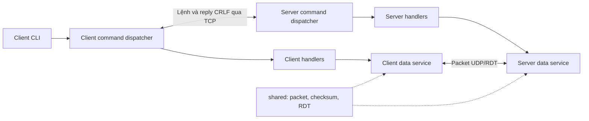
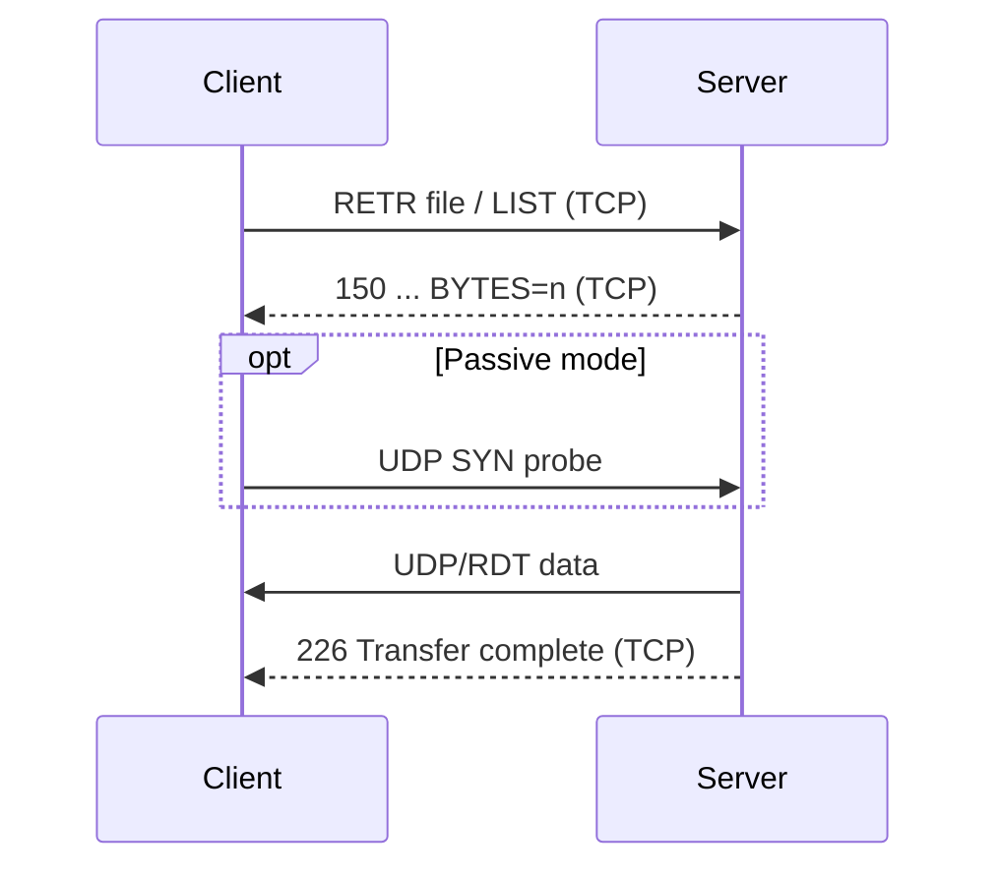
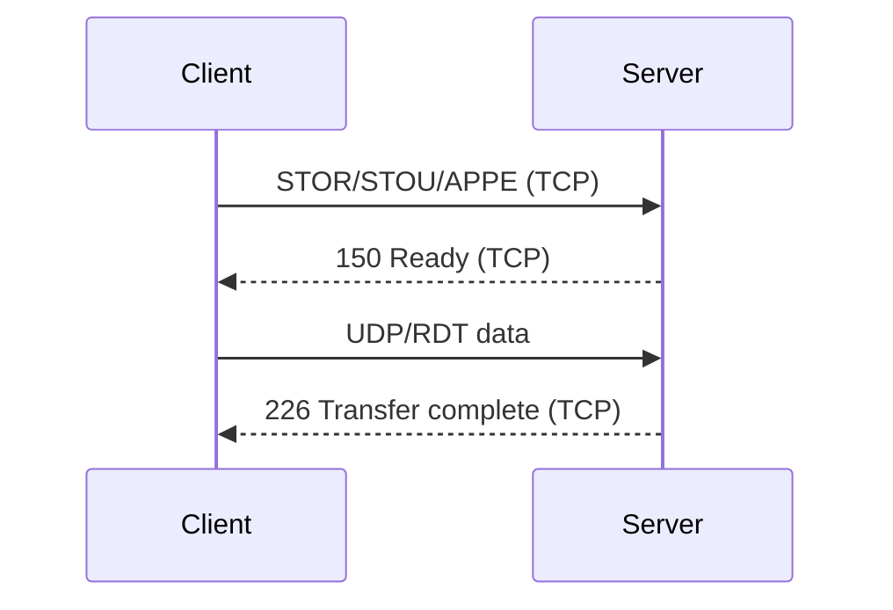

# Kiến trúc Hybrid FTP

## 1. Tổng quan

Hệ thống gồm ba package chính:

- `client`: CLI, trạng thái phía client và logic gửi/nhận dữ liệu.
- `server`: TCP server, xác thực, session và các command handler.
- `shared`: định dạng packet, checksum và RDT chạy trên UDP.

Cả hai chỉ phụ thuộc vào `shared` cho data plane.



## 2. Control plane qua TCP

### 2.1 Phía client

`client/main_client.py`:

1. Mở một TCP connection đến server.
2. Nhận greeting `220`.
3. Đọc lệnh từ CLI.
4. Tách command và argument.
5. Chuyển lệnh cho `client/control/command_handler.py`.

`ControlConnection` trong `client/control/client_control.py` sở hữu TCP socket và một buffer bền vững:

- `send_command()` thêm `\r\n`.
- `read_reply_line()` trả đúng một dòng và giữ byte dư cho lần đọc kế tiếp.
- `send_simple_command()` dùng cho lệnh chỉ có một reply.
- `send_command_and_receive_multiline_response()` đọc từ `ddd-...` đến dòng kết thúc `ddd ...`.

Các handler phía client chịu trách nhiệm:

- kiểm tra argument cục bộ;
- gửi lệnh;
- đọc đúng số reply;
- cập nhật `ClientContext` chỉ khi server chấp nhận;
- khởi chạy RDT cho lệnh có data channel;
- hiển thị tiến trình upload/download qua `cli_monitor.py`.

### 2.2 Phía server

`server/main_server.py` mở TCP listening socket tại cổng `2121`. Mỗi connection được xử lý bởi một daemon thread và có một `ClientSession` riêng.

Luồng xử lý một dòng lệnh:

```text
TCP receive buffer
  → tách theo CRLF
  → command_handler.handle_command()
  → command handler cụ thể
  → iter_command_replies()
  → sendall() từng reply
```

`server/control/command_handler.py`:

- cho phép `USER`, `PASS`, `QUIT`, `NOOP`, `HELP` trước xác thực;
- trả `530` cho các lệnh còn lại nếu chưa đăng nhập;
- dispatch sang handler theo nhóm chức năng;
- trả `502` cho command không được hỗ trợ;
- che argument của `PASS` khi ghi log.

### 2.3 Reply một dòng, nhiều dòng và nhiều giai đoạn

`server/control/ftp_codes.py` định nghĩa mã reply và định dạng `ddd message\r\n`.

Hai khái niệm khác nhau cần được giữ riêng:

1. **FTP multiline reply:** một reply logic có nhiều dòng, ví dụ `HELP`.

   ```text
   214-Available commands
   ...
   214 End
   ```

2. **Multi-stage replies:** một command phát nhiều reply ở các thời điểm khác nhau, ví dụ truyền file.

   ```text
   150 File stable; preparing to open data connection.
   ...truyền UDP/RDT...
   226 Closing data connection. Transfer complete.
   ```

`server/control/command_result.py` hỗ trợ trường hợp thứ hai:

- `CommandReply`: một reply có code, message và cờ `close_control`.
- `CommandReplies`: iterator các `CommandReply`.
- `CommandHandlerResult`: chuỗi reply cũ hoặc iterator nhiều reply.
- `iter_command_replies()`: chuẩn hóa hai dạng để vòng lặp server gửi thống nhất.

`QUIT` dùng `close_control=True`. `LIST`, `RETR`, `STOR`, `STOU` và `APPE` dùng generator để phát reply trước và sau data transfer.

## 3. Trạng thái phiên

### 3.1 `ClientContext`

`client/control/context.py` giữ trạng thái cục bộ:

| Trường | Ý nghĩa |
|---|---|
| `server_host` | Host dùng để tạo địa chỉ peer trong passive mode |
| `username`, `authenticated` | Trạng thái xác thực mà client đã nhận từ reply server |
| `transfer_type` | `A` hoặc `I`, mặc định `I` |
| `transfer_mode` | `S`, `B` hoặc `C`, mặc định `S` |
| `data_connection_mode` | `ACTIVE`, `PASSIVE` hoặc `None` |
| `data_socket` | UDP socket do client sở hữu |
| `data_peer_address` | Địa chỉ UDP server trong passive mode |

`ensure_data_socket()` tạo và bind UDP socket khi cần. `reset_data_connection()` đóng socket và xóa toàn bộ trạng thái data channel.

### 3.2 `ClientSession`

`server/control/session.py` giữ trạng thái độc lập cho từng TCP client:

| Nhóm | Trường chính |
|---|---|
| Kết nối | `client_address`, `connected_at`, `last_activity_at` |
| Filesystem | `server_root`, `current_directory` |
| Xác thực | `username`, `authenticated` |
| Cấu hình truyền | `transfer_type`, `transfer_mode`, `data_connection_mode` |
| Active UDP | `active_udp_address` |
| Passive UDP | `passive_udp_socket`, `passive_client_address` |
| Rename | `pending_rename_path` |
| Transfer | command, file, direction, kích thước, số byte và `cancel_event` |

Session có helper để:

- biểu diễn và resolve current directory;
- reset data connection và đóng passive socket;
- bắt đầu/kết thúc transfer;
- đánh dấu abort;
- reset trạng thái `RNFR`/`RNTO`;
- logout.

Các handler filesystem resolve đường dẫn rồi kiểm tra đường dẫn vẫn nằm dưới `server_root`, nhằm ngăn path traversal ra ngoài vùng dữ liệu server.

## 4. Data plane qua UDP/RDT

### 4.1 Active mode

1. Client tạo và bind UDP socket.
2. Client gửi `PORT <port>` qua TCP.
3. Server lưu `(client_ip, port)` trong `active_udp_address`.
4. Với download hoặc `LIST`, server tạo UDP socket tạm và gửi đến địa chỉ client.

Active-mode upload hiện không được hỗ trợ.

### 4.2 Passive mode

1. Client gửi `PASV`.
2. Server tạo UDP socket, bind cổng tự do và lưu socket vào session.
3. Server trả `227 ... UDP_PORT=<port>`.
4. Client giữ UDP socket của nó và lưu `(server_host, port)` vào `data_peer_address`.
5. Khi server cần gửi, client gửi một packet probe `SYN` để server khám phá địa chỉ UDP thực của client.
6. Upload dùng chính passive socket phía server để nhận dữ liệu.

Chọn lại `PORT` hoặc `PASV` gọi reset trước, nhờ đó socket và địa chỉ của mode cũ không bị tái sử dụng.

### 4.3 Data-transfer service

`client/control/data_transfer_service.py` xử lý dữ liệu trước upload và sau download.

`server/control/data_transfer_service.py`:

- kiểm tra data channel theo hướng `SEND`/`RECEIVE`;
- resolve socket và peer address cho active/passive;
- gọi `reliable_send()` hoặc `reliable_recv()`;
- áp dụng TYPE/MODE;
- hỗ trợ ghi đè hoặc append file.

Ý nghĩa cấu hình hiện tại:

| Thiết lập | Xử lý |
|---|---|
| `TYPE I` | Giữ nguyên bytes |
| `TYPE A` | Chuyển newline của văn bản UTF-8 |
| `MODE S` | Giữ nguyên payload |
| `MODE B` | Hiện giữ nguyên payload như mode S |
| `MODE C` | Nén bằng `zlib` khi gửi, giải nén khi nhận |

### 4.4 Flow truyền

Download (`RETR`) hoặc `LIST`:



Upload (`STOR`, `STOU`, `APPE`):



`STOR` ghi đè file, `STOU` tạo tên duy nhất phía server, còn `APPE` nối dữ liệu vào cuối file hoặc tạo file nếu chưa tồn tại.

`LIST` truyền listing có metadata qua data channel. `NLST` và `STAT` hiện trả thông tin trên control channel.

## 5. RDT dùng chung

### 5.1 Packet

`shared/constants.py` khai báo header `!IIHHB`, tổng cộng 13 byte:

| Field | Kích thước |
|---|---:|
| Sequence number | 4 byte |
| Acknowledgment number | 4 byte |
| Checksum | 2 byte |
| Payload length | 2 byte |
| Flags | 1 byte |

Payload tối đa là 1024 byte. Các flag gồm `SYN`, `ACK`, `FIN` và `DATA`.

### 5.2 Độ tin cậy

`shared/rdt_core.py` triển khai:

- Go-Back-N với cửa sổ 8 packet;
- cumulative ACK;
- retransmission timeout 0,3 giây;
- fast retransmit sau 3 duplicate ACK;
- Internet checksum 16-bit cho packet;
- FIN handshake để kết thúc;
- callback `(transferred_bytes, total_bytes)` cho progress monitor.

`reliable_send()` nhận bytes hoặc đường dẫn file và gửi đến một UDP peer. `reliable_recv()` ráp payload đúng thứ tự, có thể trả bytes hoặc ghi ra file.

`shared/checksum.py` cũng cung cấp SHA-256 dùng bởi lệnh `HASH`.

## 6. Phân chia command handler

Client và server cùng chia handler theo chức năng:

| Module | Lệnh |
|---|---|
| auth | `USER`, `PASS`, `QUIT` |
| common | `NOOP`, `HELP` |
| navigation | `PWD`, `CWD`, `CDUP`, `MKD`, `RMD`, `LIST`, `NLST`, `STAT`, `SIZE`, `MDTM` |
| transfer setup | `TYPE`, `MODE`, `PORT`, `PASV` |
| transfer | `RETR`, `STOR`, `STOU`, `APPE`, `ABOR` |
| file | `DELE`, `RNFR`, `RNTO`, `HASH` |

Server là nguồn quyết định cuối cùng về xác thực, filesystem và tính hợp lệ của command. Kiểm tra phía client chỉ giúp phản hồi nhanh và không thay thế validation phía server.

## 7. Dữ liệu và kiểm thử

- `server/auth/user.json`: dữ liệu tài khoản.
- `data/`: server root thực tế trong `main_server.py`.
- `data/client_downloads/`: file client tải về và vị trí upload dự phòng.
- `data/server_storage/`: thư mục dữ liệu có trong repository nhưng chưa được cấu hình làm server root riêng.
- `tests/test_checksum.py`: checksum và packet.
- `tests/test_rdt_lossy.py`: truyền RDT qua socket giả lập mất gói.

Các test hiện được viết dưới dạng script dùng `assert`:

```bash
python tests/test_checksum.py
python tests/test_rdt_lossy.py
```
