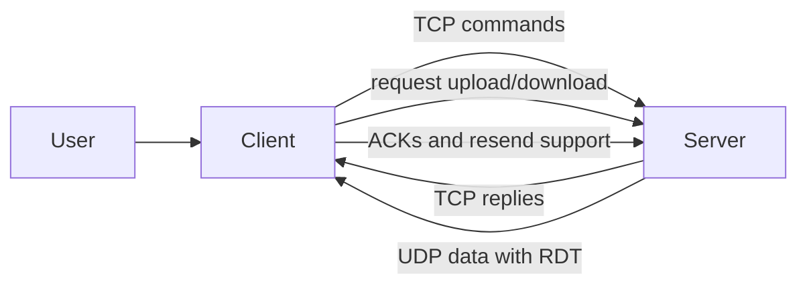

# Architecture Overview

## Purpose

This project is a hybrid FTP-style application designed to move files between a client and a server in a clear two-part flow:

- TCP is used for conversation and control.
- UDP with RDT is used for file transfer.

The goal is to keep the control channel simple and reliable while using a more robust transfer process for file data.

## Main Parts

### Client

The client is the user-facing side of the application.
It starts the connection, accepts commands from the user, and shows the server responses.
When a file needs to be sent or received, the client also takes part in preparing the data transfer.

#### Client folder structure

- `client/main_client.py`: the starting point for the client. It opens the connection to the server, shows the welcome message, and keeps asking the user for commands.
- `client/control/client_control.py`: the helper layer for sending commands to the server and reading replies in the same way the server sends them.
- `client/control/cli_monitor.py`: the place for showing progress and status while a file is being transferred.
- `client/__init__.py`: marks the client folder as a Python package.

How these parts work together:

1. The user starts the client from `main_client.py`.
2. `main_client.py` sends each command through `client_control.py`.
3. When transfer progress needs to be shown, `cli_monitor.py` helps display it.
4. The client stays active until the user leaves the session.

### Server

The server is the central side of the application.
It receives the client connection, checks the user's requests, manages session state, and decides how each command should be handled.
It also coordinates the file transfer process and keeps track of what is being uploaded or downloaded.

#### Server folder structure

- `server/main_server.py`: the server starting point. It listens for client connections, creates a separate session for each client, and forwards commands to the command handler.
- `server/auth/user_db.py`: the simple user-checking layer. It verifies whether the login information is valid.
- `server/auth/user.json`: sample user data used by the login flow.
- `server/control/command_handler.py`: the main command dispatcher. It decides which action should run for each command sent by the client.
- `server/control/ftp_codes.py`: the reply list used by the server. It keeps the status messages consistent.
- `server/control/session.py`: the session memory for one connected client. It stores login state, current folder, and transfer status.
- `server/control/handlers/auth_handler.py`: handles login and logout-related actions.
- `server/control/handlers/navigation_handler.py`: handles folder-related actions such as showing the current folder or moving to another folder.
- `server/control/handlers/transfer_setup_handler.py`: handles transfer settings such as file type and transfer mode.
- `server/control/handlers/transfer_handler.py`: handles file transfer requests and prepares the transfer state.
- `server/__init__.py`: marks the server folder as a Python package.

How these parts work together:

1. The server starts from `main_server.py`.
2. A client connects, and the server creates a session using `session.py`.
3. `command_handler.py` sends each user request to the correct handler.
4. The handler files take care of login, folder navigation, and transfer preparation.
5. `ftp_codes.py` provides the response messages that are sent back to the client.
6. `user_db.py` checks the login details against the sample user data in `user.json`.

## TCP Control Flow

TCP is used for the control conversation between the client and the server.
This channel handles the normal request and response exchange.

Typical control flow:

1. The client connects to the server.
2. The server sends a welcome message.
3. The client sends login information.
4. The server accepts or rejects the login.
5. The client sends commands such as checking the current folder, changing folders, or starting a file transfer.
6. The server answers each command with a clear status message.

This control flow stays active for the full session, so the user can keep sending commands until they choose to quit.

## UDP Data Transfer Flow With RDT

UDP is used for the actual file data transfer.
Because UDP does not guarantee delivery by itself, the project adds RDT to make the transfer more dependable.

RDT helps the transfer by:

- breaking file data into smaller pieces,
- attaching information that helps identify and verify each piece,
- checking whether the data arrived correctly,
- sending missing pieces again when needed,
- continuing until the full file has been transferred.

This approach keeps the transfer faster than a fully managed stream while still protecting against packet loss and corruption.

## Short Diagram

This simple view shows that TCP carries the commands and responses, while UDP with RDT carries the file data itself.

## Shared Support Files

The `shared` folder supports both client and server.

- `shared/checksum.py`: checks whether transferred data has been changed or damaged.
- `shared/constants.py`: stores common values used by the transfer logic.
- `shared/packet_struct.py`: defines how data packets are built and read.
- `shared/rdt_core.py`: contains the reliable transfer logic that makes UDP behave more safely for file delivery.

These shared files are part of the system glue. They do not represent the user flow by themselves, but they help both sides speak the same transfer language.

## End-to-End Flow

A normal session follows this order:

1. The client opens a TCP connection to the server.
2. The client logs in and sends commands through TCP.
3. The server prepares the transfer when the user requests upload or download.
4. The file data moves over UDP using RDT.
5. The server and client confirm when the transfer is complete.
6. The session ends when the user quits.

## Why This Design

This design separates communication into two layers:

- TCP keeps the command channel easy to understand and dependable.
- UDP with RDT keeps file transfer flexible while still handling network problems.

That separation makes the system easier to follow, easier to maintain, and better suited for learning how file transfer systems work.
