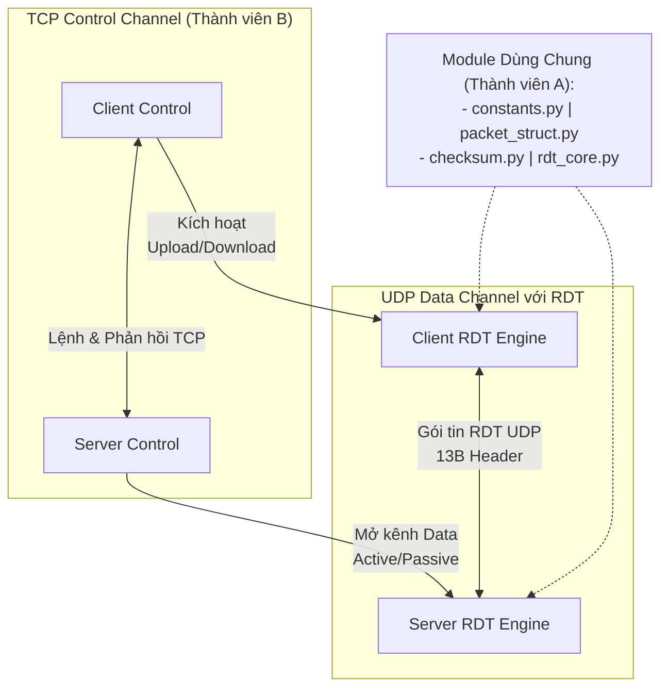

# Tổng quan kiến trúc

## Mục đích

Dự án này là một ứng dụng kiểu Hybrid FTP, được thiết kế để truyền tệp giữa client và server theo hai luồng rõ ràng:

- **TCP (Control Plane):** Dùng cho trao đổi lệnh, quản lý phiên và điều khiển trạng thái.
- **UDP kết hợp RDT (Data Plane):** Dùng cho truyền dữ liệu tệp tin cậy với cơ chế tự phát hiện lỗi và truyền lại.

Mục tiêu là giữ cho kênh điều khiển đơn giản, ổn định, đồng thời xây dựng một cơ chế truyền dữ liệu tùy chỉnh (custom RDT) mạnh mẽ trên nền UDP mà không phụ thuộc vào bất kỳ thư viện bên ngoài nào.

---

## Các phần chính

### Client

Client là phần dành cho người dùng của ứng dụng.
Nó mở kết nối, nhận lệnh từ người dùng và hiển thị phản hồi từ server.
Khi cần gửi hoặc nhận file, client cũng tham gia vào việc chuẩn bị quá trình truyền dữ liệu.

#### Cấu trúc thư mục client

- `client/main_client.py`: điểm khởi chạy của client. File này mở kết nối tới server, hiển thị lời chào và tiếp tục hỏi lệnh từ người dùng.
- `client/control/client_control.py`: lớp hỗ trợ gửi lệnh đến server và đọc phản hồi theo đúng cách server trả về.
- `client/control/command_handler.py`: bộ điều phối lệnh phía client. File này nhận lệnh từ người dùng và chuyển đến handler phù hợp.
- `client/control/cli_monitor.py`: nơi hiển thị tiến trình và trạng thái trong lúc truyền file.
- `client/control/handlers/common.py`: các helper dùng chung để gửi lệnh, đọc phản hồi và in kết quả mà không lặp lại logic.
- `client/control/handlers/auth_handler.py`: xử lý các lệnh đăng nhập và thoát ở phía client.
- `client/control/handlers/navigation_handler.py`: xử lý các lệnh điều hướng thư mục như PWD, CWD, CDUP.
- `client/control/handlers/transfer_setup_handler.py`: xử lý các lệnh thiết lập truyền như TYPE và MODE.
- `client/control/handlers/transfer_handler.py`: xử lý các lệnh truyền file như RETR và STOR.
- `client/__init__.py`: đánh dấu thư mục client là một gói Python.

**Cách các phần này phối hợp với nhau:**

1. Người dùng khởi chạy client từ `main_client.py`.
2. `main_client.py` gửi từng lệnh qua `client_control.py`.
3. `client/control/command_handler.py` chuyển lệnh đến đúng file handler trong `client/control/handlers/`.
4. `common.py` giúp các handler dùng chung cùng một cách gửi lệnh và đọc phản hồi.
5. Khi cần hiển thị tiến trình truyền, `cli_monitor.py` hỗ trợ hiển thị.
6. Client tiếp tục hoạt động cho đến khi người dùng rời phiên làm việc.

---

### Server

Server là phần trung tâm của ứng dụng.
Nó nhận kết nối từ client, kiểm tra yêu cầu của người dùng, quản lý trạng thái phiên và quyết định cách xử lý từng lệnh.
Server cũng điều phối quá trình truyền file và theo dõi file đang được upload hoặc download.

#### Cấu trúc thư mục server

- `server/main_server.py`: điểm khởi chạy của server. File này lắng nghe kết nối từ client, tạo một phiên riêng cho mỗi client và chuyển lệnh tới bộ xử lý lệnh.
- `server/auth/user_db.py`: lớp kiểm tra người dùng đơn giản. Nó xác minh thông tin đăng nhập có hợp lệ hay không.
- `server/auth/user.json`: dữ liệu mẫu của người dùng dùng cho luồng đăng nhập.
- `server/control/command_handler.py`: bộ điều phối lệnh chính. Nó quyết định hành động nào sẽ chạy cho mỗi lệnh client gửi lên.
- `server/control/ftp_codes.py`: danh sách phản hồi của server. File này giúp các thông báo trạng thái được thống nhất.
- `server/control/session.py`: bộ nhớ phiên của một client đang kết nối. Nó lưu trạng thái đăng nhập, thư mục hiện tại và trạng thái truyền.
- `server/control/handlers/auth_handler.py`: xử lý các hành động liên quan đến đăng nhập và đăng xuất.
- `server/control/handlers/navigation_handler.py`: xử lý các hành động liên quan đến thư mục, như xem thư mục hiện tại hoặc di chuyển sang thư mục khác.
- `server/control/handlers/transfer_setup_handler.py`: xử lý các thiết lập truyền như kiểu dữ liệu và chế độ truyền.
- `server/control/handlers/transfer_handler.py`: xử lý các yêu cầu truyền file và chuẩn bị trạng thái truyền.
- `server/__init__.py`: đánh dấu thư mục server là một gói Python.

**Cách các phần này phối hợp với nhau:**

1. Server được khởi chạy từ `main_server.py`.
2. Một client kết nối vào, và server tạo một session bằng `session.py`.
3. `command_handler.py` chuyển từng yêu cầu của người dùng đến đúng bộ xử lý.
4. Các file handler đảm nhiệm phần đăng nhập, điều hướng thư mục và chuẩn bị truyền file.
5. `ftp_codes.py` cung cấp các thông điệp phản hồi gửi về cho client.
6. `user_db.py` kiểm tra thông tin đăng nhập với dữ liệu mẫu trong `user.json`.

---

## Luồng điều khiển TCP (Control Plane — Phần do Thành viên B đảm nhiệm)

TCP được dùng cho phần trao đổi điều khiển giữa client và server.
Kênh này xử lý luồng yêu cầu và phản hồi thông thường.

**Luồng điều khiển điển hình:**

1. Client kết nối tới server qua cổng TCP cố định.
2. Server gửi một thông báo chào mừng (`220 Service ready`).
3. Client gửi thông tin đăng nhập (`USER`, `PASS`).
4. Server chấp nhận hoặc từ chối đăng nhập (`230 Login successful` / `530 Not logged in`).
5. Client gửi các lệnh quản lý thư mục (`PWD`, `CWD`, `LIST`) hoặc lệnh chuẩn bị truyền file (`TYPE`, `PASV`, `PORT`).
6. Server trả lời từng lệnh bằng các mã trạng thái chuẩn RFC 959.

Luồng điều khiển này được giữ ổn định trong suốt phiên làm việc cho đến khi client gửi lệnh `QUIT`.

---

## Luồng truyền dữ liệu UDP với RDT (Data Plane — Phần do Thành viên A đảm nhiệm)

UDP được dùng cho kênh truyền dữ liệu tệp thực tế. Vì UDP nguyên bản là giao thức không tin cậy (Unreliable), dự án xây dựng một lớp giao thức RDT (Reliable Data Transfer) độc lập ở tầng ứng dụng.

### Cấu trúc chi tiết gói tin RDT Custom Header (13 Bytes)

Mọi gói tin truyền qua UDP đều chứa một Header 13-Byte được tuần tự hóa theo định dạng **Network Byte Order (Big-Endian)**:

| Trường (Field) | Kiểu dữ liệu | Kích thước | Mô tả |
| :--- | :--- | :--- | :--- |
| **Sequence Number** | Unsigned Int (`I`) | 4 Bytes | Số thứ tự định danh cho từng gói tin (0, 1, 2, ...). |
| **Acknowledgment Number** | Unsigned Int (`I`) | 4 Bytes | Số thứ tự xác nhận tích lũy (Cumulative ACK). |
| **Checksum** | Unsigned Short (`H`) | 2 Bytes | Mã kiểm lỗi Internet Checksum 16-bit của toàn bộ gói. |
| **Payload Length** | Unsigned Short (`H`) | 2 Bytes | Độ dài phần dữ liệu thực tế (0 đến 1024 bytes). |
| **Flags** | Unsigned Char (`B`) | 1 Byte | Bitmask điều khiển (`SYN=1`, `ACK=2`, `FIN=4`, `DATA=8`). |

### Các cơ chế kỹ thuật nổi bật của RDT Engine

1. **Cửa sổ trượt Go-Back-N (Sliding Window $N = 8$):** Bên gửi có thể đẩy liên tục tối đa 8 gói tin lên đường truyền trước khi bắt buộc phải dừng lại chờ ACK, tối ưu hóa băng thông gấp nhiều lần so với cơ chế Stop-and-Wait.
2. **Fast Retransmit (3 Duplicate ACKs):** Khi bên gửi nhận liên tiếp 3 ACK lặp lại cho cùng một gói tin, hệ thống xác định gói tin tiếp theo đã bị rớt mạng và lập tức gửi lại gói đó ngay mà không cần chờ bộ đếm thời gian Timeout (RTO) kết thúc.
3. **Cumulative ACK & In-Order Delivery:** Bên nhận chỉ chấp nhận dữ liệu đúng thứ tự `expected_seq`. Phản hồi ACK tích lũy cho biết gói tin lớn nhất đã nhận an toàn. Các gói đến sai thứ tự hoặc hỏng bit sẽ bị loại bỏ và kích hoạt phản hồi Duplicate ACK.
4. **Xác thực toàn vẹn End-to-End (SHA-256):** Hỗ trợ tính năng kiểm tra Hash mật mã cho toàn bộ file trước và sau khi gửi để đảm bảo độ chính xác $100\%$ ngay cả trong môi trường mạng hỏng.

---

## Các file hỗ trợ dùng chung (Shared) và Kiểm thử (Tests) — Do Thành viên A phát triển

Thư mục `shared/` chứa toàn bộ lõi kỹ thuật xử lý dữ liệu nhị phân và RDT Engine, đóng vai trò làm API dịch vụ cho cả Client và Server. Thư mục `tests/` phục vụ việc kiểm thử độc lập.

### 1. `shared/constants.py` (Cấu hình hệ thống & Hằng số mạng)
- Định nghĩa kích thước khối dữ liệu `MAX_PAYLOAD = 1024` bytes (1 KB).
- Định nghĩa cấu trúc Header nhị phân `HEADER_FORMAT = '!IIHHB'` (13 Bytes).
- Cấu hình tham số cửa sổ trượt `WINDOW_SIZE = 8`, thời gian chờ `TIMEOUT = 0.3s`, và ngưỡng Fast Retransmit `DUP_ACK_THRESHOLD = 3`.
- Định nghĩa các cờ bitwise điều khiển `FLAG_SYN`, `FLAG_ACK`, `FLAG_FIN`, `FLAG_DATA`.

### 2. `shared/checksum.py` (Kiểm tra lỗi 16-bit & Hash File)
- **`compute_checksum(data_bytes)`:** Thực hiện thuật toán Internet Checksum 16-bit (Cộng bù 1 tất cả các cụm 16-bit rồi lấy nghịch đảo bit).
- **`verify_checksum(packet_bytes)`:** Tự động kiểm tra xem gói tin nhận được có bị biến đổi bit trên đường truyền hay không (kết quả cộng bù 1 toàn bộ gói tin phải bằng 0).
- **`compute_file_hash(file_path)`:** Đọc file theo từng khối 4KB để tính mã băm SHA-256 tích lũy, phục vụ xác thực toàn vẹn cho lệnh `HASH`.

### 3. `shared/packet_struct.py` (Đóng gói & Rã gói nhị phân)
- **`pack_packet(seq, ack, flags, data)`:** Sử dụng cơ chế đóng gói 2 bước (Two-pass packing): Tạo header tạm tính checksum $\rightarrow$ Nhét checksum thực vào header $\rightarrow$ Nối dữ liệu để tạo mảng byte thô gửi qua Socket.
- **`unpack_packet(packet_bytes)`:** Băm tách mảng byte nhận từ socket thành các thuộc tính Header (`seq`, `ack`, `checksum`, `length`, `flags`) và `payload`.

### 4. `shared/rdt_core.py` (Bộ não RDT Engine & API Truyền dữ liệu)
- **`reliable_send(udp_socket, dest_addr, data_or_file_path)`:** API gửi dữ liệu/file tin cậy cho Thành viên B gọi. Quản lý cửa sổ trượt Go-Back-N, đếm giờ Timer, xử lý 3 Duplicate ACKs (Fast Retransmit) và bắt tay kết thúc truyền `FIN`.
- **`reliable_recv(udp_socket, save_file_path)`:** API nhận dữ liệu/file tin cậy cho Thành viên B gọi. Lắng nghe UDP socket, lọc gói hỏng/lặp, sắp xếp dữ liệu đúng thứ tự, phản hồi Cumulative ACK và ghi file ra đĩa cứng.

### 5. `tests/test_checksum.py` (Unit Test Đóng gói & Checksum)
- Kiểm thử độc lập khả năng đóng gói nhị phân, rã gói và phát hiện nhiễu bit khi giả lập đổi bit ngẫu nhiên trong gói tin.

### 6. `tests/test_rdt_lossy.py` (Kịch bản mô phỏng truyền file trên mạng lỗi)
- Định nghĩa lớp `LossyUDPSocket` để cố tình làm mất $20\%$ số gói tin ngẫu nhiên trên đường truyền.
- Chạy thử nghiệm gửi/nhận một file 100KB qua kênh mạng lỗi $20\%$, tự động đối chiếu mã băm SHA-256 giữa bên gửi và bên nhận để chứng minh tính chịu lỗi tuyệt đối của RDT Engine.

---

## Sơ đồ tổng quan kiến trúc hệ thống

Sơ đồ trên minh họa sự tách biệt giữa hai kênh giao tiếp trong hệ thống:

- **Kênh điều khiển (TCP Control Plane):** Đảm nhận việc trao đổi lệnh và phản hồi giữa Client và Server, đồng thời chịu trách nhiệm khởi tạo và thống nhất cổng truyền dữ liệu (chế độ Active hoặc Passive).
- **Kênh dữ liệu (UDP Data Plane):** Thực hiện việc truyền file thực tế qua giao thức RDT tùy chỉnh, sử dụng các gói tin UDP chứa Header 13 bytes và được hỗ trợ trực tiếp bởi các module dùng chung trong thư mục `shared/`.

## Các file hỗ trợ dùng chung

Thư mục `shared/` chứa các module dùng chung cho cả client và server, đảm bảo tính nhất quán về cấu trúc gói tin, kiểm tra lỗi và cơ chế truyền file.

- `shared/constants.py`: Lưu các hằng số mạng và tham số cấu hình như `MAX_PAYLOAD` (1024 bytes), `WINDOW_SIZE` (8), `TIMEOUT` (0.3s), `DUP_ACK_THRESHOLD` (3) và các cờ điều khiển (`FLAG_SYN`, `FLAG_ACK`, `FLAG_FIN`, `FLAG_DATA`).
- `shared/checksum.py`: Cung cấp hàm tính Internet Checksum 16-bit để phát hiện lỗi bit trên từng gói tin UDP và hàm tính mã băm SHA-256 để kiểm tra toàn vẹn file.
- `shared/packet_struct.py`: Chứa các hàm đóng gói (`pack_packet`) và rã gói (`unpack_packet`) nhị phân theo cấu trúc Header 13 bytes (Network Byte Order - Big-Endian).
- `shared/rdt_core.py`: Cung cấp hai API chính cho việc truyền nhận dữ liệu tin cậy là `reliable_send()` (quản lý cửa sổ trượt, timer, Fast Retransmit) và `reliable_recv()` (sắp xếp gói tin, gửi Cumulative ACK và ghi file).

Các module này xử lý toàn bộ logic truyền tải dữ liệu bên dưới, giúp phần mã nguồn của client và server chỉ cần gọi hàm mà không phải viết lại cơ chế RDT.

## Luồng tổng thể của một phiên làm việc

1. **Khởi tạo:** Client mở kết nối TCP đến Server, thực hiện luồng đăng nhập qua `auth_handler`.
2. **Thiết lập kênh truyền:** Client gửi lệnh `PASV` (Passive Mode) hoặc `PORT` (Active Mode) qua TCP để hai bên thống nhất cổng UDP truyền dữ liệu.
3. **Yêu cầu truyền file:** Client gửi lệnh `RETR <filename>` (Download) hoặc `STOR <filename>` (Upload) qua TCP.
4. **Truyền dữ liệu tin cậy qua UDP (RDT):**
   - Phía gửi gọi `reliable_send()`, chia file thành các khối 1024 bytes, đóng gói Header 13 Bytes và đẩy qua cửa sổ trượt Go-Back-N ($N=8$).
   - Phía nhận gọi `reliable_recv()`, kiểm tra lỗi bit qua Internet Checksum, phản hồi Cumulative ACK, loại bỏ gói lặp và ghi file.
   - Nếu mạng rớt gói, cơ chế **Fast Retransmit (3 Dup ACKs)** hoặc **Timeout Retransmit** sẽ tự động phục hồi dữ liệu bị mất.
5. **Xác thực toàn vẹn (SHA-256):** Sau khi kết thúc truyền, client gửi lệnh `HASH <filename>` qua TCP. Server dùng `compute_file_hash()` tính mã SHA-256 của file và trả về cho Client đối chiếu.
6. **Kết thúc:** Phiên làm việc kết thúc khi người dùng chọn lệnh `QUIT`.

---

## Vì sao thiết kế như vậy

- **Tách biệt rõ ràng giữa Control Plane và Data Plane:** Giúp kênh lệnh TCP luôn thông suốt, không bị treo hay gián đoạn khi đang truyền file dung lượng lớn qua UDP.
- **Tự đóng gói RDT từ đầu (Zero-library requirement):** Việc tự triển khai các trường Sequence Number, Cumulative ACK, Internet Checksum 16-bit và Sliding Window Go-Back-N trên nền UDP thuần giúp đáp ứng hoàn toàn các tiêu chuẩn đánh giá khắt khe nhất (Mức Xuất sắc / Excellent Tier) của đề tài.
- **Đóng gói dưới dạng API mô-đun hóa:** Các hàm `reliable_send` và `reliable_recv` của Thành viên A được đóng gói hoàn chỉnh, giúp Thành viên B dễ dàng gọi và tích hợp vào xử lý logic của Server/Client mà không cần quan tâm đến sự phức tạp bên dưới của giao thức mạng.