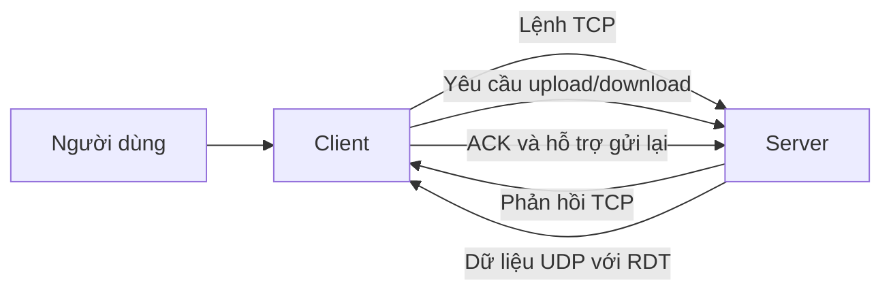

# Tổng quan kiến trúc

## Mục đích

Dự án này là một ứng dụng kiểu Hybrid FTP, được thiết kế để truyền tệp giữa client và server theo hai luồng rõ ràng:

- TCP dùng cho trao đổi lệnh và điều khiển.
- UDP kết hợp RDT dùng cho truyền dữ liệu tệp.

Mục tiêu là giữ cho kênh điều khiển đơn giản, ổn định, đồng thời dùng một cơ chế truyền dữ liệu chắc chắn hơn cho phần file.

## Các phần chính

### Client

Client là phần dành cho người dùng của ứng dụng.
Nó mở kết nối, nhận lệnh từ người dùng và hiển thị phản hồi từ server.
Khi cần gửi hoặc nhận file, client cũng tham gia vào việc chuẩn bị quá trình truyền dữ liệu.

#### Cấu trúc thư mục client

- `client/main_client.py`: điểm khởi chạy của client. File này mở kết nối tới server, hiển thị lời chào và tiếp tục hỏi lệnh từ người dùng.
- `client/control/client_control.py`: lớp hỗ trợ gửi lệnh đến server và đọc phản hồi theo đúng cách server trả về.
- `client/control/command_handler.py`: bộ điều phối lệnh phía client. File này nhận lệnh từ người dùng và chuyển đến handler phù hợp.
- `client/control/cli_monitor.py`: nơi hiển thị tiến trình và trạng thái trong lúc truyền file.
- `client/control/handlers/common.py`: các helper dùng chung để gửi lệnh, đọc phản hồi và in kết quả mà không lặp lại logic.
- `client/control/handlers/auth_handler.py`: xử lý các lệnh đăng nhập và thoát ở phía client.
- `client/control/handlers/navigation_handler.py`: xử lý các lệnh điều hướng thư mục như PWD, CWD, CDUP.
- `client/control/handlers/transfer_setup_handler.py`: xử lý các lệnh thiết lập truyền như TYPE và MODE.
- `client/control/handlers/transfer_handler.py`: xử lý các lệnh truyền file như RETR và STOR.
- `client/__init__.py`: đánh dấu thư mục client là một gói Python.

Cách các phần này phối hợp với nhau:

1. Người dùng khởi chạy client từ `main_client.py`.
2. `main_client.py` gửi từng lệnh qua `client_control.py`.
3. `client/control/command_handler.py` chuyển lệnh đến đúng file handler trong `client/control/handlers/`.
4. `common.py` giúp các handler dùng chung cùng một cách gửi lệnh và đọc phản hồi.
5. Khi cần hiển thị tiến trình truyền, `cli_monitor.py` hỗ trợ hiển thị.
6. Client tiếp tục hoạt động cho đến khi người dùng rời phiên làm việc.

### Server

Server là phần trung tâm của ứng dụng.
Nó nhận kết nối từ client, kiểm tra yêu cầu của người dùng, quản lý trạng thái phiên và quyết định cách xử lý từng lệnh.
Server cũng điều phối quá trình truyền file và theo dõi file đang được upload hoặc download.

#### Cấu trúc thư mục server

- `server/main_server.py`: điểm khởi chạy của server. File này lắng nghe kết nối từ client, tạo một phiên riêng cho mỗi client và chuyển lệnh tới bộ xử lý lệnh.
- `server/auth/user_db.py`: lớp kiểm tra người dùng đơn giản. Nó xác minh thông tin đăng nhập có hợp lệ hay không.
- `server/auth/user.json`: dữ liệu mẫu của người dùng dùng cho luồng đăng nhập.
- `server/control/command_handler.py`: bộ điều phối lệnh chính. Nó quyết định hành động nào sẽ chạy cho mỗi lệnh client gửi lên.
- `server/control/ftp_codes.py`: danh sách phản hồi của server. File này giúp các thông báo trạng thái được thống nhất.
- `server/control/session.py`: bộ nhớ phiên của một client đang kết nối. Nó lưu trạng thái đăng nhập, thư mục hiện tại và trạng thái truyền.
- `server/control/handlers/auth_handler.py`: xử lý các hành động liên quan đến đăng nhập và đăng xuất.
- `server/control/handlers/navigation_handler.py`: xử lý các hành động liên quan đến thư mục, như xem thư mục hiện tại hoặc di chuyển sang thư mục khác.
- `server/control/handlers/transfer_setup_handler.py`: xử lý các thiết lập truyền như kiểu dữ liệu và chế độ truyền.
- `server/control/handlers/transfer_handler.py`: xử lý các yêu cầu truyền file và chuẩn bị trạng thái truyền.
- `server/__init__.py`: đánh dấu thư mục server là một gói Python.

Cách các phần này phối hợp với nhau:

1. Server được khởi chạy từ `main_server.py`.
2. Một client kết nối vào, và server tạo một session bằng `session.py`.
3. `command_handler.py` chuyển từng yêu cầu của người dùng đến đúng bộ xử lý.
4. Các file handler đảm nhiệm phần đăng nhập, điều hướng thư mục và chuẩn bị truyền file.
5. `ftp_codes.py` cung cấp các thông điệp phản hồi gửi về cho client.
6. `user_db.py` kiểm tra thông tin đăng nhập với dữ liệu mẫu trong `user.json`.

## Luồng điều khiển TCP

TCP được dùng cho phần trao đổi điều khiển giữa client và server.
Kênh này xử lý luồng yêu cầu và phản hồi thông thường.

Luồng điều khiển điển hình:

1. Client kết nối tới server.
2. Server gửi một thông báo chào mừng.
3. Client gửi thông tin đăng nhập.
4. Server chấp nhận hoặc từ chối đăng nhập.
5. Client gửi các lệnh như xem thư mục hiện tại, đổi thư mục, hoặc bắt đầu truyền file.
6. Server trả lời từng lệnh bằng một thông báo trạng thái rõ ràng.

Luồng điều khiển này được giữ trong suốt phiên làm việc, nên người dùng có thể tiếp tục gửi lệnh cho đến khi chọn thoát.

## Luồng truyền dữ liệu UDP với RDT

UDP được dùng cho phần truyền dữ liệu thực tế của file.
Vì UDP không tự đảm bảo việc giao hàng đầy đủ, dự án thêm RDT để việc truyền ổn định hơn.

RDT hỗ trợ quá trình truyền bằng cách:

- chia dữ liệu file thành các phần nhỏ hơn,
- gắn thông tin giúp nhận diện và kiểm tra từng phần,
- kiểm tra xem dữ liệu có đến đúng hay không,
- gửi lại những phần bị thiếu khi cần,
- tiếp tục cho đến khi toàn bộ file được truyền xong.

Cách làm này giúp việc truyền nhanh hơn so với một luồng được quản lý hoàn toàn, nhưng vẫn bảo vệ khỏi mất gói và lỗi dữ liệu.

## Sơ đồ ngắn

Sơ đồ này cho thấy TCP dùng để truyền lệnh và phản hồi, còn UDP với RDT dùng để truyền chính dữ liệu file.

## Các file hỗ trợ dùng chung

Thư mục `shared` hỗ trợ cả client lẫn server.

- `shared/checksum.py`: kiểm tra xem dữ liệu truyền đi có bị thay đổi hoặc hỏng hay không.
- `shared/constants.py`: lưu các giá trị dùng chung cho logic truyền dữ liệu.
- `shared/packet_struct.py`: định nghĩa cách đóng gói và đọc các gói dữ liệu.
- `shared/rdt_core.py`: chứa logic truyền tin cậy giúp UDP hoạt động an toàn hơn cho việc gửi file.

Các file dùng chung này là phần kết nối giữa hai phía. Chúng không tự tạo ra luồng người dùng, nhưng giúp cả hai bên “nói cùng một ngôn ngữ” khi truyền dữ liệu.

## Luồng tổng thể

Một phiên làm việc thông thường diễn ra theo thứ tự sau:

1. Client mở kết nối TCP đến server.
2. Client đăng nhập và gửi lệnh qua TCP.
3. Server chuẩn bị truyền khi người dùng yêu cầu upload hoặc download.
4. Dữ liệu file đi qua UDP bằng RDT.
5. Server và client xác nhận khi truyền xong.
6. Phiên làm việc kết thúc khi người dùng thoát.

## Vì sao thiết kế như vậy

Thiết kế này tách giao tiếp thành hai lớp:

- TCP giúp kênh lệnh dễ hiểu và đáng tin cậy.
- UDP với RDT giúp truyền file linh hoạt hơn nhưng vẫn xử lý được các vấn đề mạng.

Sự tách biệt này làm cho hệ thống dễ theo dõi hơn, dễ bảo trì hơn và phù hợp hơn cho mục đích học cách hệ thống truyền file hoạt động.
